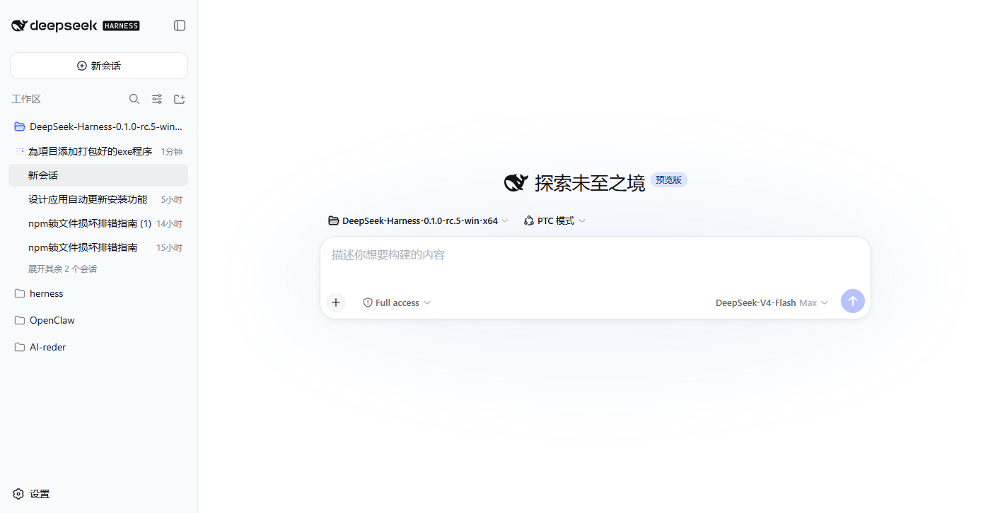
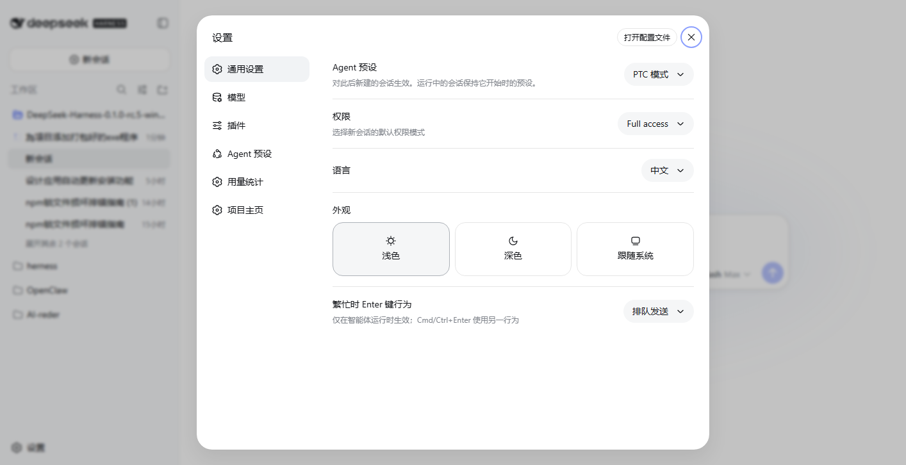
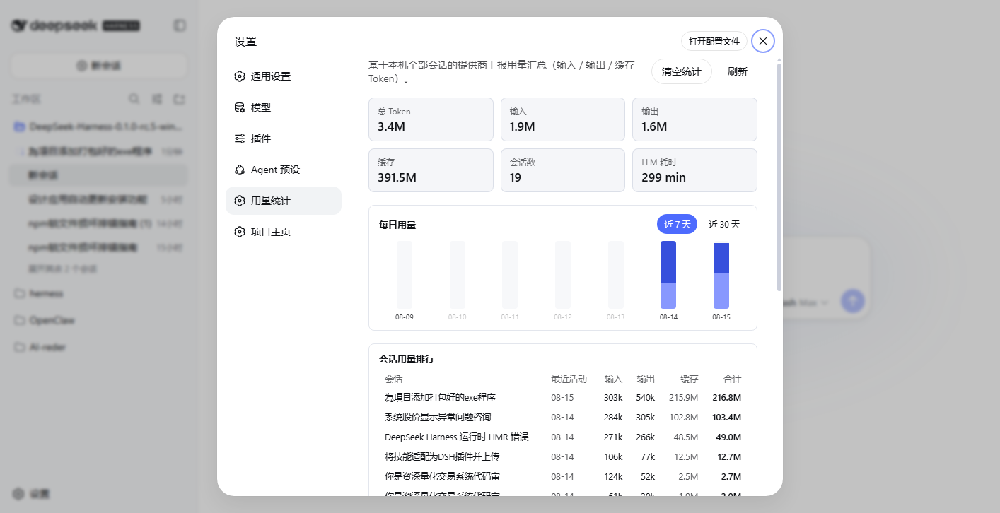
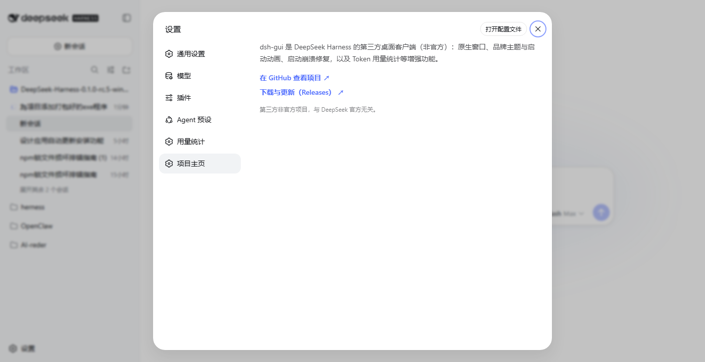

# DeepSeek Harness 桌面版客户端（GUI）

> 把 DeepSeek Harness 装进一个原生桌面窗口：品牌化启动动画、DeepSeek 设计语言界面、稳定启动。
> 第三方非官方项目（与 DeepSeek / DeepSeek AI 官方无关）。
>
> English: A desktop GUI client for DeepSeek Harness — native window, branded splash animation, DeepSeek design language UI, and a stable startup (includes the rc.5 startup crash fix). Third-party, unofficial.

## 下载与安装 / Download & Install

前往 [Releases](https://github.com/xuboboo/dsh-gui/releases) 下载最新版本：

- **`dsh-gui-v1.0.49-win-x64-asar.zip`**（Windows 自动升级 hotfix）— 最新版，修复旧版本自动升级后 `error: unknown option '--no-open'`、heal 被锁目录 `ENOTEMPTY`/`EPERM` 崩启动、`client-modules missed the module table`（客户端插件按内容自愈）、v1.0.47 的 heal 作用域崩溃，并**自动部署 MCP 设置页**（升级机/新装机开箱即用）；升级机下次启动自动自愈。**全新安装请用完整包 `dsh-gui-v1.0.49-win-x64.zip`**。如需官方 rc.5 稳定版可回退到 v1.0.17。
- **`dsh-gui-v1.0.49-mac-universal.zip`**（macOS Universal）— 最新 mac 包，与 Windows 版同版本同功能（含 MCP 设置页自动部署、客户端插件自愈），**同时支持 Intel 芯片与 Apple 芯片（M1/M2/M3/M4）原生运行**；要求 macOS 11+；解压后将 `DeepSeek Harness.app` 拖入「应用程序」。未签名构建：首次打开若提示"无法验证开发者/已损坏"，右键 App → 打开（一次即可），或执行 `xattr -dr com.apple.quarantine "/Applications/DeepSeek Harness.app"`。

### 安装步骤

1. 解压 zip 到任意目录（建议英文路径，如 `D:\Tools\dsh-gui`）
2. 双击 **`DeepSeek Harness.exe`**
3. 首次启动会显示品牌启动动画，几秒后进入主界面

**无需安装 Node.js 或其他任何运行时**——exe 已内置完整运行环境，解压即用。

### 卸载

删除解压目录即可。用户数据（会话、配置）保存在 `%USERPROFILE%\.dsh`，如需彻底清除可一并删除。

## 系统要求 / System requirements

- 操作系统：Windows 10 / 11（64 位），或 macOS 11+（Intel / Apple 芯片均支持，Universal 原生运行）
- 内存：建议 4 GB 以上
- 磁盘：Windows 解压后约 365 MB（zip）/ 约 650 MB（解压后）；macOS 完整包约 429 MB（zip）
- **无需 Node.js / npm / pnpm / 任何开发环境**（内置运行时）

## 使用说明 / Usage

### 首次启动

1. 双击 `DeepSeek Harness.exe`
2. 等待品牌启动动画结束（首次启动需初始化，约 3–10 秒）
3. 在界面中配置模型服务（设置 → 模型，填入你的 DeepSeek API Key）即可开始对话

### 日常使用

- 本地服务默认运行在 `http://127.0.0.1:3081`（仅本机可访问）
- 界面语言：简体中文（默认），可在界面内切换
- 支持浅色 / 深色主题，跟随系统或手动切换

### 端口冲突

如果 3081 端口被占用，可设置环境变量后重启：

```
DSH_DESKTOP_PORT=3082
```

### 常见问题 / FAQ

**Q：需要先安装 Node.js 吗？**
A：不需要。本客户端完全自包含，运行时已内置在 exe 中，解压后双击即可使用。

**Q：杀毒软件提示风险？**
A：本客户端为第三方构建、未做商业签名，Windows SmartScreen / 杀毒软件可能提示。来源为本仓库 Releases 的安装包可放心使用；也可以选择自行构建（见下文源码构建）。

**Q：启动后白屏 / 无法打开？**
A：请确认已解压完整（不要直接运行压缩包内的 exe）；首次启动请耐心等待动画结束。仍失败可查看日志 `%APPDATA%\@deepseek-ai\dsh-root\logs\desktop.log`。

**Q：数据存放在哪里？**
A：用户数据（会话记录、配置、凭据）保存在 `%USERPROFILE%\.dsh`，与官方版本一致。

**Q：如何更新？**
A：关注本仓库 Releases，下载新版 zip 解压覆盖即可（保留 `%USERPROFILE%\.dsh` 即可保留数据）。

## 特性 / Features

- 🪟 **原生桌面窗口** — 独立窗口承载完整 Harness Web UI
- 🎬 **品牌启动动画** — logo 呼吸光晕 + 双环加载动画 + 深色渐变背景（纯 CSS，无外部依赖）
- 🎨 **DeepSeek 设计语言界面** — token 级主题覆盖：品牌蓝主按钮、浅蓝消息气泡、蓝调选中/悬停态、细圆角滚动条、品牌色选区与焦点环、柔和过渡与按压反馈
- 🔧 **rc.5 启动崩溃修复** — launcher 补传 --expose-internals、profile 依赖落盘、ensureSymlink 兼容真实目录
- 📋 **复制按钮修复（v1.0.1）** — 放行 `clipboard-sanitized-write` 权限，对话/代码块复制按钮恢复可用
- 📊 **Token 用量统计（v1.0.2）** — 设置页新增用量统计：总览卡片、每日柱状图（7/30 天）、会话排行；支持**清空统计**（非破坏性，不删会话）与一键**恢复完整统计**
- 🌗 **浅色 / 深色双主题** — 跟随系统或手动切换，两套配色均对齐品牌

## 更新日志 / Changelog

### v1.0.53（2026-09-05）

- 🪟 **修复升级/启动后长时间黑屏** — v1.0.52 把 `firstBoot` 误声明为当就绪 handler else 块内的块级 `let`，模块级函数 `createWindow()` 引用它时抛 `ReferenceError: firstBoot is not defined`，首次窗口创建失败、落到空窗口；4 秒看门狗只是强制显示一个没内容的空窗口，于是用户看到黑屏，直到运行时引导完成才有内容。已把 `firstBoot` 移到模块顶层声明，窗口一创建即显示品牌启动页（不黑屏），运行时就绪后再跳转到应用页。

### v1.0.52（2026-09-04）

- 🔁 **运行时意外退出自动拉起** — 子运行时成功就绪后若自行退出，launcher 不再只显示「运行时已停止」页，而是 1.5 秒后静默拉起一次（带退避预算：连续快速崩溃最多自动重试 2 次；单次运行超过 2 分钟后预算重置），彻底失败才落到停止页。顺带修复一个隐藏 bug：启动重试复用了已失效的 startup promise，会在不重新拉起进程的情况下瞬间复报旧错误（v1.0.51 及以前日志里 "startup failed → startup retry failed" 之间没有新 spawn 就是它）。
- 🪟 **升级重启后窗口必现** — `app.relaunch()` 拉起的新进程在 Windows 上没有前台权限，更新后的窗口可能开在所有窗口后面，看起来像"没自动打开、要手动重开"；现在升级后的首次显示会抢占焦点（app.focus steal），并新增"从未显示看门狗"（4 秒内渲染进程没画出就强制显示）与窗口创建/显示诊断日志。
- 🔕 **升级完成后不再弹「更新完成」对话框** — 只记日志，避免弹窗抢在窗口前面分散注意力。
- ♻️ **退出时不再重复应用更新包** — before-quit 的标记文件名对不上（检查 `applied.json`、实际写的是 `applied.txt`），点「立即重启」后退出阶段会把 ~344MB 的 app.asar 再拷贝一遍；已修正，升级重启更快更干净。

### v1.0.51（2026-09-02）

- ⚡ **启动提速：运行时提前拉起，与 Electron 初始化重叠** — launcher 在模块加载阶段（app.whenReady 之前）就启动子运行时，其引导（模块加载 / profile heal / Loader 就绪）与 Electron 自身的 Chromium 初始化、菜单安装、启动页渲染并行，串行等待时间减少约 1~3 秒（实测本机运行时引导 2~5 秒：全新 profile 首启约 3 秒，已有 profile 约 4.5 秒；日志目录也提前建立，提前拉起的启动记录不再丢失）。
- ⏳ **自动更新首查延后到启动 30 秒后**（原 8 秒）— 更新检查的 TLS 握手与 JSON 解析不再与运行时引导抢 CPU/网络，弱机启动更稳。
- 💬 **启动页文案更诚实** — 移除「首次启动可能需要几秒钟」；首次启动（无 ~/.dsh/profiles）显示「首次启动需要初始化本地运行时（仅此一次）」。
- 📝 修正文档中「首次启动约 1~2 分钟 / 1~3 分钟」的过时描述（seed junction 方案下本机实测数秒）。
- 🧰 **打包工具修复：asar 补齐运行时点文件** — @electron/asar 的 glob 默认不匹配点文件，
  `@earendil-works/pi-ai/dist/providers/data/.manifest.json`（all.js 引用）没进 asar → pi-ai 的 asar 副本内部是坏的，
  平时靠 profile→seed 才能启动；一旦走 asar 解析（无 seed/seed 不完整）就 ERR_MODULE_NOT_FOUND。pack.mjs 现在补进
  node_modules lib/dist 内的点文件（本轮仅 pi-ai 一个），asar 与 seed 一致、自足。
- ⚠️ **解压工具提醒** — PowerShell Expand-Archive 解压完整包会静默丢 ~2.5 万个 seed 文件，
  请用资源管理器 / 7-Zip / WinRAR 解压（README 已注明）。

### v1.0.43（2026-08-24）

- 🔧 **修复旧版本自动升级后启动崩溃 `error: unknown option '--no-open'`** — 自动更新只替换 `app.asar`、不替换 `dsh-profile-seed`；旧版写下的 `.dsh-heal-stamp.json` 让新版的「上次成功」自愈快路径**跳过版本校验**，profile 仍 junction 到旧 rc.5 seed，其 `@deepseek-ai/dsh-web-app` 运行时并不解析 `--no-open`（仅文档写了），于是新 launcher 传入的 `--no-open` 被判为未知选项 → 启动退出码 1。本次让 heal stamp 快路径同样做 `manifestsMatch` 版本校验，版本不一致时不再跳过：seed 落后则**从当前 asar 自带的 rc.2 `@deepseek-ai/*` 实拷贝**，升级机下次启动自动自愈，无需重装全量包。

### v1.0.42（2026-08-23）

- 🧩 **新增「MCP 目录」插件** — 设置 → 插件 → 新增「MCP」标签页：内置常用服务器目录（everything / memory / sequential-thinking / filesystem / github / brave-search / puppeteer / sqlite）与自定义服务器表单；一键启用/停用/改配，通过 `@deepseek-ai/dsh-mcp-client` **即时热挂载（免重启）**；配置存于 `~/.dsh/settings.yaml` 的 `mcp-catalog` 命名空间。模型侧工具名形如 `mcp__<服务名>__<工具名>`。
- 🔧 **修复含中文/空格路径的插件加载崩溃** — cordis-plugin-loader 在 Windows 上把绝对路径插件名统一转换为 `file://` URL 后再走 ESM 导入，根治 `ERR_UNSUPPORTED_ESM_URL_SCHEME (protocol 'c:')`。
- 🛡️ 客户端模块扫描器兼容自定义包：`dsh.client` 双面包的 `exports` 需显式列出 `./package.json` 子路径（否则解析被静默跳过）；扫描锚点为 profile 目录，跨层分发需双锚点放置（详见仓库 audit-notes）。
- 🍎 **macOS Universal 同步更新**（`dsh-gui-v1.0.42-mac-universal.zip`，430 MB）— 与 Windows 版同功能；Intel + Apple 芯片原生（fat binary 已校验）；要求 macOS 11+；未签名。

### v1.0.41（2026-08-22）

- 🔧 **修复"立即重启"不重启 GUI** — 点更新提示条的「立即重启」后应用退出但不重新打开。根因：`before-quit` 处理器在 `applyUpdateAndRelaunch` 调 `app.relaunch()` + `app.quit()` 时，`before-quit` 里 `event.preventDefault()` + `stopHarness().then(app.exit(0))` 用 `app.exit(0)` 硬退出，杀死了 `app.relaunch()` 计划的新实例（Windows 上 relaunch 子进程随父进程的 Job Object 一起终止）。修复：新增 `relaunching` 标志，`applyUpdateAndRelaunch` 设置它，`before-quit` 检测到后走**正常退出**（`app.quit()` 而非 `app.exit(0)`），让 Electron 尊重 `app.relaunch()`。
- 🛠️ 自包含 app.asar（兼容旧版本自动升级）。
- 📁 目录选择器 GUI 原生对话框（根治 koffi worker 崩溃）。
- 🖼️ 官方 rc.2 多模态。
- 🍎 **新增 macOS Universal 版**（`dsh-gui-v1.0.41-mac-universal.zip`，429 MB）— Electron 43.4.0 双架构原生二进制（x86_64 + arm64，同一 .app 同时支持 Intel 与 Apple 芯片）；内置 darwin 双架构全套原生模块（node-pty / sharp / libvips / koffi / ripgrep / oxc 等）；mac 更新器走 `*-mac-universal-asar.zip` 资产；下载器/系统代理/退出应用更新脚本已做 macOS 适配（curl、sh 兜底）。要求 macOS 11+；未签名，首次打开需右键 → 打开或 `xattr -dr com.apple.quarantine`。

### v1.0.40（2026-08-22）

- 🛠️ **恢复自包含 app.asar（关键兼容性修复）** — 旧版本（1.0.17 及更早）打包是"自包含 asar"（node_modules 全部打进 `app.asar`，`app.asar.unpacked` 只放原生模块）；而 1.0.38/1.0.39 误改成"全 unpack"（node_modules 全在 unpacked，asar 只剩空壳 10 MB）。这导致旧用户 **只替换 app.asar 升级**时，新 asar 是空壳却找不到 unpacked 里的 node_modules → 启动报 `ENOENT ... app.asar.unpacked/node_modules/@deepseek-ai/dsh/lib/bin.js` / `runtime exited with code 1`。本版**恢复自包含 asar**（`app.asar` 328 MB 自带全部 node_modules），旧用户升级兼容性彻底修复。
- 📁 **目录选择器 GUI 修复随自动升级生效** — GUI 原生对话框调用已前移至 `host.pickDirectory`（app.asar 内），配合自包含 asar，旧用户升级替换 `app.asar` 后即生效。根治 `win32 folder dialog worker exited before reporting a result`。
- 🖼️ 底层官方 **rc.2 多模态**（图片/附件输入）。
- 🧹 结构瘦身（完整包 341 MB）；保留全部运行时依赖与 19 项安全补丁。

### v1.0.39（2026-08-22）

- 📁 **目录选择器 GUI 修复随自动升级生效** — 将 GUI 原生对话框（Electron `dialog.showOpenDialog`，127.0.0.1:3082）的调用前移至 `host.pickDirectory`（app.asar 内），旧用户自动升级替换 `app.asar` 后即生效，不再依赖重建 seed。目录选择器改用 Electron 原生模态框，根治 `win32 folder dialog worker exited before reporting a result`、中文路径乱码、对话框被遮挡、焦点误触关机、选择结果被超时丢弃等问题。

### v1.0.38（2026-08-22）

- 🖼️ **新增支持多模态能力，适配官方多模态能力** — 底层基于官方 **rc.2（0.1.1-rc.2）多模态**，支持图片/附件输入（`dsh-client-ui-attachment`、`dsh-attachment`、ACP 等），与官方多模态能力对齐。
- 📁 **目录选择器改用 GUI 原生对话框（根治 koffi worker 崩溃）** — 新电脑/新目录选工作区不再报 `win32 folder dialog worker exited before reporting a result`。改为优先走 Electron 原生模态对话框（127.0.0.1:3082），仅在 GUI 端点不可达（web-only / 旧桌面）时回退 koffi worker；彻底解决 koffi 崩溃、中文路径乱码、对话框被遮挡、焦点误触关机、选择结果被超时丢弃等一系列问题。已在本机实测（真实弹窗选目录返回正确路径）。
- 🧹 **结构瘦身** — 完整包从 **904 MB 降到 365 MB**（省 60%）。剔除 codex/claude 子代理 CLI（353 MB + 253 MB，可用 `dsh plugin add` 按需装回）、rolldown/oxlint/lefthook/typescript 等开发工具链、以及 10199 个 `.map` 调试文件；保留全部运行时依赖（koffi/sharp/node-pty/ripgrep 原生模块）与 19 项安全补丁。
- 🐛 **修复新电脑首次启动崩溃**（`Cannot find package '@babel/code-frame'` / `runtime exited with code 1`）— 瘦身时误删了运行时必需的 `@babel/code-frame` 及 `@babel/helper-validator-identifier`（`cordis-plugin-hmr` 硬依赖），现已恢复，新电脑可正常启动。

### v1.1.0（2026-08-22）

- 🖼️ **升级到官方最新多模态版本（rc.2 / `0.1.1-rc.2`）** — 底层从官方 rc.5（0.1.0-rc.5）升级到官方最新多模态 rc.2，新增图片/附件输入能力（`dsh-client-ui-attachment`、`dsh-attachment`、ACP 等）。
- 🔧 **升级后启动崩溃根治** — 官方 rc.2 的 `dsh-app-boot` `ensureSymlink` 遇真实目录会抛错；改为直接跳过，并移植 v1037 的完整 `healProfilesModuleFallback`（种子 junction 优先 + asar 实体拷贝 + 原生模块处理 + heal stamp），保证新电脑首次启动 / ESM 解析 / 版本一致性。
- 📁 **目录选择器改用官方原生** — 官方 rc.2 已自带 `worker.cjs` + koffi 原生 `IFileOpenDialog`；移除 v1037 的 PowerShell 兜底 worker 强制覆盖（避免用旧协议破坏 rc.2 原生选择器），保留 3082 兜底。
- 🖥️ **防自动弹浏览器** — rc.2 的 `dsh web` 默认会打开系统浏览器；spawn 加 `--no-open`，由桌面窗口承载。
- 📊 **Token 用量统计插件修复** — 官方 rc.2 移除了 `@deepseek-ai/dsh-client-web-react`，导致该插件加载失败；改为内联 `bindSnapshotSelector`（React `useSyncExternalStore`），不再依赖被删包。

### v1.0.17（2026-08-17）

- 🔄 **修复"自动更新无限循环"**（v1.0.16 更新循环问题）：内置版本号 `DSH_GUI_VERSION` 同步为 1.0.17，不再自我触发更新；更新器对"暂存版本不高于当前版本"的旧更新包自动清理，退出时不再应用旧包（即使之前循环残留，升级后也会自动清除）。

### v1.0.16（2026-08-17）

- 🐛 **修复新电脑首次启动失败**（`runtime exited with code 1` / `ERR_MODULE_NOT_FOUND`）：Windows 下 `healProfilesModuleFallback` 不再创建指向 `app.asar` 内部路径的 Junction（Node ESM 加载器无法解析这类路径），改为实体拷贝 `app.asar` 与 `app.asar.unpacked` 中的全部依赖（含 node-pty / sharp / koffi / ripgrep 等原生模块）到 `%USERPROFILE%\.dsh\profiles\node_modules`；已有完整目录跳过、残留 Junction 替换，首次启动自动完成（1–3 分钟），之后正常速度。已在全新 `DSH_HOME` 环境实测通过。

### v1.0.15（2026-08-16）

- 🔄 **修复"立即重启后启动失败"**：立即重启时先停本地服务（释放 3081 端口）再退出；启动失败自动清理残留端口进程并重试
- 🐛 **修复更新解压失败**（Invalid package config）：fflate 解压库加载改三级回退（asar → 绝对路径 → profile 真实文件系统）

### v1.0.14（2026-08-15）

- 🐛 **修复"每次启动弹已自动更新"循环**：更新暂存清理顺序错误导致重复应用，已修正

### v1.0.13（2026-08-15）

- 📁 **目录选择器最终修复**：改为 **GUI 原生对话框**（Electron dialog，模态、必见、焦点安全，网页版与桌面版共用），彻底解决：koffi 崩溃、中文路径乱码、对话框被遮挡、焦点误触关机、选择结果被超时丢弃等一系列问题
- 🛡️ 修复版 worker 内嵌启动器，每次启动自愈覆盖

### v1.0.12（2026-08-15）

- 📁 **目录选择器彻底修复**（v1.0.10 修复不彻底，本次根治）：worker 字符串读取越界导致选中目录后原生崩溃；改为安全逐字符读取，自动化测试通过（真实对话框→自动选目录→正确返回路径）
- 🔄 **启动自愈**：每次启动自动用修复版覆盖 profile 中的官方缺陷文件，已装用户升级后无需手动操作

### v1.0.11（2026-08-15）

- 🔍 **全程序体检修复**（审计 v1.0.10 全部代码路径）：
  - 已暂存更新的重启提示在**启动时立即弹出**（不再等 8 秒自动检查）
  - 原地应用后正确记录，下次启动弹"已更新到 vX"确认
  - GitHub API 检查/校验失败自动切换 curl（直连→系统代理），不再静默失败
  - 主进程未捕获异常/拒绝写入日志，可追溯
  - 窗口关闭后停止 toast 轮询，无资源泄漏
  - 未应用的暂存更新不再被启动清理（异常退出不丢更新）

### v1.0.10（2026-08-15）

- 📁 **修复"添加工作区"无法打开文件夹选择器**：补齐官方 rc.5 漏发的 `worker.cjs` 与 koffi Windows 平台绑定（`patches/0010-workspace-directory-picker-fix.patch`）

### v1.0.9（2026-08-15）

- 🤫 **静默升级**：发现新版本后无弹窗打扰，后台静默下载 → 校验 → 自动暂存；完成后在**应用左下角**弹出提示条「更新已就绪 vX.Y.Z」（立即重启 / 稍后重启）
  - 立即重启：退出并自动重启完成安装；稍后重启：下次退出应用时自动应用
  - 同时修复"稍后重启"从未生效的问题（before-quit 检查了错误的文件名）
- 🗑️ 移除下载进度弹窗、下载通知、更新前确认框（`patches/0009-silent-update-restart-toast.patch`）
- ⚡ **并行分块下载**：更新包按字节范围拆成 12 路并发下载（直连→系统代理逐块回退），实测受限网络上 **~14 倍提速**（单连接 11 KB/s → 并行 157 KB/s），sha256 校验不变
- 🔧 **"立即重启"真正可用**：修复自动重启从未生效的问题——Electron 退出时会杀死其派生的子进程（Windows Job Object），导致旧的 PowerShell 应用脚本从未执行；改为**主进程原地覆盖 app.asar + `app.relaunch()`**，退出后自动重新打开即为新版本（退出时应用更新同样原地覆盖）

### v1.0.8（2026-08-15）

- 🎨 **更新进度弹窗重做**：去掉"正方形深色框 + 圆角卡片"两层折叠效果，改为单层扁平深色卡片；**进度真实化**——curl 下载通道此前不上报进度（进度条停在原地像假的），现实时解析 curl 进度并统一显示，"已下 X / 共 Y MB + 百分比"同源计算不再对不上（`patches/0008-update-progress-window.patch`）

### v1.0.7（2026-08-15）

- 🐛 **修复"重新启动本地服务"误报错误页**：帮助菜单 → 重新启动本地服务 不再闪现"运行时已停止 / runtime exited with code 1"错误页；旧进程会等其完全退出后再启动新服务，连点也不会反复杀掉刚起来的服务（`patches/0007-restart-no-error-flash.patch`）

### v1.0.6（2026-08-15）

- 🔄 **自动更新完善**：下载进度显示、失败必反馈、帮助菜单 → 关于（版本信息）、更新内容预览；提示框统一为系统原生对话框

### v1.0.4（2026-08-15）

- 📊 **下载进度窗口**：更新下载实时进度条；多通道下载快速失败切换
- ℹ️ **帮助菜单 → 关于 dsh-gui**：版本号与项目信息
- 🐛 下载失败必提示原因（不再无响应）

### v1.0.3（2026-08-15）

- 🔄 **新增自动更新**：帮助菜单 → 检查更新；启动后自动检查（每 6 小时）；发现新版本显示更新内容，一键下载（约 33 MB 增量包）安装，失败自动回滚（`patches/0006-auto-updater.patch`）
- 发布流程：每次发版需同时上传整包 + asar 更新包（见下方「发版清单」）

### v1.0.2（2026-08-15）

> 修复多个 Bug 并新增功能：复制按钮无反应、启动崩溃（v1.0.0 起）、帮助菜单项目主页指向、设置页布局问题等均已修复。

- 📊 **新增 Token 用量统计设置页**：总览卡片（输入/输出/缓存/会话数/LLM 耗时）、每日用量柱状图（近 7/30 天）、会话用量排行（Top 50）；**清空统计**仅重置统计起点（不删除任何会话记录，localStorage 持久），可随时**恢复完整统计**
- 实现：浏览器端插件 `client-plugins/ui-settings-token-usage`（聚合 `session.list` 投影列，零日志加载）
- 🏠 **项目主页**：设置页新增"项目主页"页（GitHub 仓库 + Releases 直达链接）；**帮助菜单 → 项目主页**改为指向本仓库（`patches/0005-menu-project-homepage.patch`）
- 🔄 **自动更新（v1.0.2）**：帮助菜单 → 检查更新；启动后自动检查（每 6 小时），发现新版本显示更新内容并一键下载安装（`patches/0006-auto-updater.patch`）

### v1.0.1（2026-08-15）

- 🐛 **修复复制按钮无反应**：官方 launcher 拒绝一切权限请求（`setPermissionRequestHandler` 一律 `callback(false)`），导致 `navigator.clipboard.writeText` 被拒、复制按钮静默失效。v1.0.1 放行 `clipboard-sanitized-write` 权限（见 `patches/0003-launcher-clipboard-permission.patch`）。

### v1.0.0（2026-08-14）

- 首个发行版：品牌启动动画、DeepSeek 设计语言主题、rc.5 启动崩溃修复

## 界面预览 / Preview

| 主界面 | 设置 | Token 用量统计 | 项目主页 |
| --- | --- | --- | --- |
|  |  |  |  |


## 发版清单 / Release checklist

> 自动更新依赖以下步骤，**每步都不能漏**，否则客户收不到更新：

1. **改版本号**：`desktop/lib/main.js` 的 `DSH_GUI_VERSION` 常量改为新版本（如 `1.0.3`）
2. **打整包**：`dsh-gui-vX.Y.Z-win-x64.zip`（解压即用完整包）
3. **打更新包**：`dsh-gui-vX.Y.Z-win-x64-asar.zip`（仅 `resources/app.asar`，zip 内路径 `resources/app.asar`）——客户端自动更新下载的就是它
4. **上传两个包**到 GitHub Release（整包 + asar 更新包，tag `vX.Y.Z`）
5. **验证**：帮助菜单 → 检查更新 应提示新版本；或等启动后 8 秒自动检查

> 说明：自动更新下载 asar 更新包（约 33 MB）并校验 GitHub sha256 后替换 `app.asar`，无需重新下载 280 MB 整包；更新失败会自动回滚并提示手动下载。

## 面向开发者 / For developers

本仓库包含客户端的三块核心资产：

```
├── theme/
│   └── dsw-override.css        # 界面主题覆盖层（DeepSeek 设计语言）
├── splash/
│   ├── splash-page.html        # 启动动画页模板（浏览器可直接预览）
│   └── launcher-patch.md       # 启动动画接入 launcher 的说明
├── patches/
│   ├── 0001-launcher-expose-internals.patch   # 启动修复 1
│   ├── 0002-app-boot-ensure-symlink.patch     # 启动修复 2
│   ├── 0003-launcher-clipboard-permission.patch # 复制按钮修复（剪贴板权限）
│   └── README.md               # rc.5 启动崩溃修复完整方案
└── SECURITY.md                 # 安全与敏感信息说明
```

### 应用主题（无需改动应用文件）

1. 复制 `theme/dsw-override.css` 到前端 dist：`<profile>/node_modules/@deepseek-ai/dsh-web-frontend/dist/assets/`
2. 在 `dist/index.html` 的 `<head>` 中、主 CSS（`index-*.css`）之后追加：

```html
<link rel="stylesheet" crossorigin href="/assets/dsw-override.css">
```

3. 刷新页面即生效。此后只需维护这一个文件即可持续调整界面细节。

### 启动动画与启动修复

详见 `splash/launcher-patch.md` 与 `patches/README.md`（涉及 `resources/app.asar` 解包/重打包，请保留原始备份）。

### 从官方源码构建

本客户端基于 [DeepSeek Harness](https://github.com/deepseek-ai/deepseek-harness)（官方，MIT）桌面版构建。从源码构建需要 Node.js 环境（仅构建时需要，运行无需）——此场景才需要 `Install Node.js, then run: pnpm install`。

## 技术实现 / How it works

| 模块 | 方案 |
| --- | --- |
| 桌面窗口 | Electron 原生窗口承载 Harness Web UI |
| 运行时 | Electron 内置 Node（ELECTRON_RUN_AS_NODE）运行 dsh 服务，完全自包含 |
| 启动动画 | 纯 CSS 动画的 data: URL 页面，图标运行时内嵌 base64，无外部资源依赖 |
| 界面主题 | CSS 变量（--dsw-* token）覆盖层，后加载覆盖原设计系统，不破坏组件 |
| 启动修复 | launcher 补传 --expose-internals；profile 依赖从 junction 改为真实文件；ensureSymlink 兼容真实目录 |

## 安全 / Security

本仓库经严格敏感信息扫描：不含任何 API key、密码、凭据、本地数据或本地路径（检查方法见 SECURITY.md）。

## 免责声明 / Disclaimer

独立的第三方项目，与 DeepSeek / DeepSeek AI 官方无关。DeepSeek Harness 是官方项目（MIT）。

## 许可证 / License

MIT License © dsh-gui contributors

